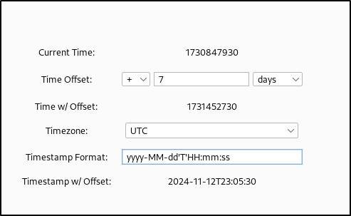

# Timestamp Injector
An easy way to inject up-to-date timestamps into HTTP requests in Burp Suite. Load the extension, replace the value of an outdated timestamp in an HTTP request with "UnixTimeS", and Burp will automatically inject the current Epoch time into this location.

There is a UI interface where you can define a time offset so injected timestamps occur in either the future or past. You can also define a custom timestamp (I.E. yyyy-MM-dd) in the UI to inject.



## Examples

### `UnixTimeS` and `UnixTimeMS`
If you want a timestamp in seconds:
```
{"timestamp": UnixTimeS}
```
Becomes:
```
{"timestamp": 1730349175}
```
If you want a timestamp in milliseconds:
```
{"timestamp": UnixTimeMS}
```
Becomes:
```
{"timestamp": 1730349333065}
```

### `TimeStamp` and `URLTimeStamp`
To inject a custom timestamp defined in the UI:
```
{"timestamp": TimeStamp}
```
Becomes:
```
{"timestamp":2024-11-04 04:43:53 UTC}
```
You can do the same thing, but automatically URL-encode the timestamp with:
```
{"timestamp": URLTimeStamp}
```
Becomes:
```
{"timestamp":2024-11-04+04%3A48%3A49+UTC}
```

## Releases
See the [Releases] page for a pre-built jar.

I hope to have this extension on the BAppStore soon.

## Acknowledgements
This extension took inspiration from Alex Lauerman's Token Incrementor Burp Extension. Link below
https://github.com/PortSwigger/token-incrementor
