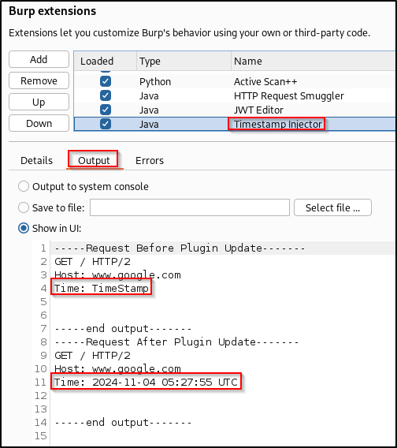

# Timestamp Injector
An easy way to inject up-to-date timestamps into HTTP requests in Burp Suite. Load the extension, replace the value of an outdated timestamp in an HTTP request with "UnixTimeS", and Burp will automatically inject the current Epoch time into this location.

There is a UI interface where you can define a time offset so injected timestamps occur in either the future or past. You can also define a custom timestamp (I.E. yyyy-MM-dd) in the UI to inject.


## Examples

### `UnixTimeS` and `UnixTimeMS`
If you want a timestamp in seconds:
```
{"timestamp": UnixTimeS}
```
Becomes:
```
{"timestamp": 1730349175}
```
<br>

If you want a timestamp in milliseconds:
```
{"timestamp": UnixTimeMS}
```
Becomes:
```
{"timestamp": 1730349333065}
```

<br>

### `TimeStamp` and `URLTimeStamp`
To inject a custom timestamp defined in the UI:
```
{"timestamp": TimeStamp}
```
Becomes:
```
{"timestamp":2024-11-04 04:43:53 UTC}
```

<br>

You can do the same thing, but automatically URL-encode the timestamp with:
```
{"timestamp": URLTimeStamp}
```
Becomes:
```
{"timestamp":2024-11-04+04%3A48%3A49+UTC}
```

<br>

Custom timestamps are validated and generated using the [SimpleDateFormat](https://docs.oracle.com/javase/8/docs/api/java/text/SimpleDateFormat.html) Java class. You can use single quotes (') around text to include it as-is. For instance:
```
yyyy-MM-dd'T'HH:mm:ss'Z'
```
Translates to:
```
2024-10-31T04:14:31Z
```

<br>

## Debugging
All modified calls will appear in the Extension tab in the 'Timestamp Injector' output in Burp Suite.



<br>

## Build
Requires Gradle to build. Once that is installed, run the following command from the root directory:
```
gradle build
```
That should create a 'build' directory with a jar file you can import into Burp Suite.

<br>

## Releases
See the [Releases](https://github.com/eric-m-holub/timestamp-injector/releases/latest) page for pre-built jar files.

I hope to have this extension on the BApp Store soon.

<br>

## Acknowledgements
This extension took inspiration from Alex Lauerman's [Token Incrementor](https://github.com/PortSwigger/token-incrementor) Burp Extension.
